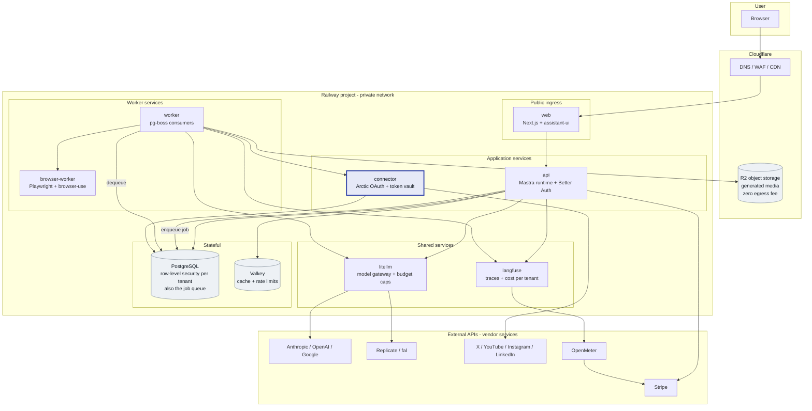
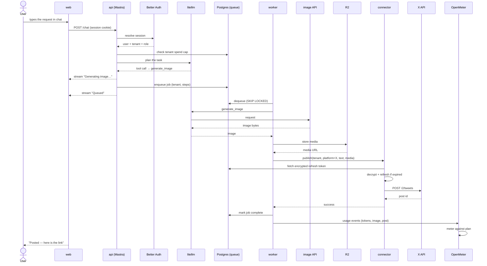
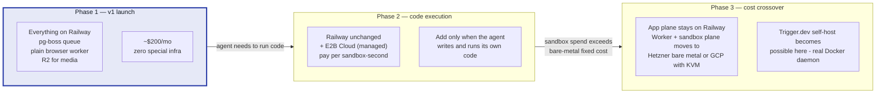

# Deployment architecture

**SocialPi — how the stack runs, where it runs, and what it costs**

> Companion documents: [`open-source-stack-audit.md`](./open-source-stack-audit.md) — which components were cleared and why.

| | |
|---|---|
| **Researched** | 12 August 2026 |
| **Target platform** | Railway |
| **Verdict** | ✅ Railway works for v1 — but only after two components are swapped out |

---

## Answer first: can we use Railway?

**Yes for v1, and it is a good fit — but not for the stack exactly as specified.** Two components in the audited stack cannot run on Railway at all, for the same underlying reason.

Railway **prohibits privileged containers, blocks Docker daemon access, and prevents container-runtime installation**. There is also no SSH access to the underlying host. This is deliberate and Railway has stated there are no plans to change it.

That breaks two things:

| Component | Why it breaks on Railway | Resolution for v1 |
|---|---|---|
| **Trigger.dev** (self-hosted) | The v4 supervisor launches each task run as a **new container**. It ships a Docker Socket Proxy instead of raw socket access, but the proxy still has to reach a real Docker daemon on a host you control. Railway gives you no such daemon. | **Use `pg-boss` instead.** Postgres-backed durable queue, `SKIP LOCKED` concurrency, ACID, no extra infrastructure. Runs as an ordinary Railway service. |
| **E2B** (self-hosted) | Firecracker microVMs need read/write access to **`/dev/kvm`** — bare metal or nested virtualisation. Self-hosting also means a Terraform + Nomad + Consul control plane, GCP minimums of 2,500 GB SSD and 24 vCPU, and a reported **~$1,250/month floor**. | **Don't deploy a sandbox in v1 at all.** See below. |

### The E2B question is really a scope question

E2B exists to isolate **untrusted, model-generated code**. Look at what v1 actually does — compose a post, generate an image, publish it, occasionally drive a browser. None of that executes arbitrary code.

Browser automation with Playwright / browser-use runs perfectly well in a **standard unprivileged container**. It needs no KVM, no Firecracker, no privileged mode.

So: ship v1 with a plain `browser-worker` service on Railway. Add E2B only when you let the model write and run its own code — and when you do, use **E2B Cloud** (managed, pay-per-use) rather than self-hosting. Self-hosting E2B would cost more than five times your entire v1 platform bill.

> **Licence note that matters here:** self-hosted Trigger.dev v4 bundles **MinIO (AGPL-3.0)** by default for large payloads. A second reason to defer it — and if you do adopt Trigger.dev later, point its object storage at S3/R2 instead of the bundled MinIO.

---

## Deployment topology — v1

Everything inside the Railway box talks over Railway's private network. Nothing but `web` is publicly exposed.

**Reading the diagram:**

- **`connector` is the only service you write from scratch** (highlighted). It holds encrypted per-tenant refresh tokens and is the only service permitted to call the social platforms.
- **Postgres is doing two jobs** — application data *and* the job queue, via pg-boss. That is the single biggest simplification versus the original stack: no Redis-backed queue, no container-spawning supervisor, no separate durable-execution control plane.
- **Only `web` is publicly reachable.** `api`, `connector`, `litellm` and `langfuse` bind to the private network only. This matters: `connector` holds your customers' credentials and should never have a public route.
- **Media lands in R2, not Railway volumes.** Railway charges **$0.10/GB egress**; R2 charges none. For a product that uploads video, that difference compounds fast.

---

## End-to-end flow — user perspective through to backend

What actually happens when someone types *"post a picture of our new product on X"*.

Three details that are easy to get wrong and expensive to retrofit:

1. **The spend cap is checked *before* the model call**, not after. Uncapped token spend is the most common way these products die.
2. **The refresh token never leaves `connector`.** `api` and `worker` ask `connector` to publish; they never handle credentials themselves. That is the boundary an enterprise security review will look for.
3. **Usage events are emitted per job, not per billing cycle.** Retrofitting metering onto an unmetered system means reconstructing history you never recorded.

---

## Railway service-by-service compatibility

| Service | Runs on Railway? | Notes |
|---|---|---|
| `web` — Next.js | ✅ | Public domain, autoscale replicas. |
| `api` — Mastra + Better Auth | ✅ | Private network only. |
| `connector` — Arctic OAuth | ✅ | Private network only. Needs a stable egress IP if a platform allowlists — verify per platform. |
| `worker` — pg-boss | ✅ | Ordinary long-running process. Scale by replica count. |
| `browser-worker` — Playwright | ✅ | Unprivileged container is sufficient. Memory-hungry; give it its own service so it scales independently. |
| `litellm` | ✅ | MIT core only — exclude `enterprise/`. |
| `langfuse` | ✅ | MIT core only — exclude `ee/`, `web/src/ee/`, `worker/src/ee/`. |
| PostgreSQL | ✅ | Railway-managed. Enable RLS. Take your own backups too. |
| Valkey | ✅ | Deploy from image. |
| **Trigger.dev (self-host)** | ❌ | Worker supervisor needs a Docker daemon. Use pg-boss. |
| **E2B (self-host)** | ❌ | Needs `/dev/kvm`. Use E2B Cloud later, or nothing now. |
| Object storage | ⚠️ | Use Cloudflare R2, not Railway volumes — egress cost and durability. |

**Railway platform limits, for reference:** Pro allows up to 1,000 vCPU and 1 TB RAM per service and 42 replicas; Hobby is capped at 48 vCPU / 48 GB and 6 replicas. Four regions available. None of these are close to binding for v1.

---

## Cost model

### Railway, v1 steady state

Estimated from Railway's published unit rates — **$0.000463/vCPU-minute, ~$0.014/GB-hour RAM, $0.10/GB egress** — at modest always-on sizing:

| Service | Sizing | Est. /month |
|---|---|---|
| `web` | 0.5 vCPU · 1 GB | ~$20 |
| `api` | 1 vCPU · 2 GB | ~$40 |
| `worker` | 0.5 vCPU · 1 GB | ~$20 |
| `browser-worker` | 1 vCPU · 2 GB | ~$40 |
| `litellm` | 0.25 vCPU · 0.5 GB | ~$10 |
| `langfuse` | 0.5 vCPU · 1 GB | ~$20 |
| PostgreSQL | 1 vCPU · 2 GB + 20 GB volume | ~$40 |
| Valkey | 0.25 vCPU · 0.5 GB | ~$10 |
| | **Infrastructure subtotal** | **~$200** |

Plus **$20/seat/month** for the Pro plan, plus egress, plus per-request costs below. Call it **$150–250/month** for a low-traffic v1 — these are estimates from published rates, not quotes.

### Per-request costs — the ones that scale with users

| Item | Rate | Watch out for |
|---|---|---|
| X post | **$0.015**, or **$0.20 with a link** | Price credits against the link rate. 50 link-posts/day/user ≈ **$300/month for one user**. |
| LLM tokens | Per provider | Cap per tenant in LiteLLM, enforced before the call. |
| Image generation | Per provider | Cheapest to meter as a discrete unit, not by token. |
| Railway egress | $0.10/GB | Video uploads. Where a platform accepts a **media URL** (Instagram Graph API does), publish by URL from R2 and skip the egress entirely. |

### The comparison that settles the sandbox question

| Option | Monthly |
|---|---|
| Entire v1 platform on Railway | ~$200 |
| Self-hosted E2B alone | ~$1,250 |

Self-hosting the sandbox would cost roughly six times the rest of the platform combined, to isolate code you are not yet running.

---

## How this evolves — deployment-first roadmap

**Why this ordering is safe:** every managed service in Phase 2 is a component whose source is Apache-2.0. Choosing E2B Cloud or Trigger.dev Cloud now does **not** lock you in — the self-host path stays open, and Phase 3 is a migration you can actually execute. That is the practical payoff of the licence audit: managed-first is reversible here, which it would not have been with an Elastic-licensed component.

### Triggers to leave Railway

Watch for these rather than guessing:

- **Sandbox spend consistently exceeds ~$1,250/month** → bare metal beats managed E2B.
- **You need a region Railway does not offer** (data residency, EU/India customer requirements).
- **Egress exceeds ~1 TB/month** → $100+/month in transfer alone; move media handling to a provider with free or cheaper egress.
- **You need privileged containers for anything else** → the constraint recurs; plan the move once rather than working around it repeatedly.

Until one of those fires, Railway's operational simplicity is worth more than the savings.

---

## What to build in what order

1. **Register the platform developer apps.** Meta, TikTok and YouTube reviews take weeks and block nothing else. Start day one.
2. **Railway project skeleton** — `web`, `api`, Postgres, Valkey on the private network, custom domain through Cloudflare.
3. **Auth + tenancy + billing** — Better Auth organisations, Stripe, OpenMeter, and a hard per-tenant spend cap in LiteLLM *before* any agent exists.
4. **`connector` for X only** — real OAuth, real encrypted tokens, end to end. This is the riskiest component; prove it in isolation.
5. **`api` agent runtime** — Mastra with exactly three tools: generate image, compose post, publish.
6. **`worker` + pg-boss** once a task outgrows a single request.
7. **`browser-worker`** only when a target has no usable API.

---

## Open questions to resolve before committing

- **Stable egress IP** — some platform APIs allowlist source IPs. Confirm whether Railway can provide a static egress address for `connector`, or whether that forces a proxy.
- **Data residency** — Railway has four regions. If EU or India residency is a requirement for target customers, confirm coverage before building.
- **Postgres backup policy** — Railway-managed Postgres is convenient, but take independent backups off-platform from day one.
- **Region for `browser-worker`** — browser automation against geo-restricted content may need specific egress geography.

---

## Sources

- [Railway: privileged mode not supported](https://station.railway.com/feedback/allow-services-to-be-run-in-privileged-m-8c66b22b) · [Docker-in-Docker request](https://station.railway.com/feature-request/docker-in-docker-d07c4730) · [Pricing plans](https://docs.railway.com/pricing/plans)
- [Trigger.dev v4 self-hosting (Docker)](https://trigger.dev/docs/self-hosting/docker) · [v4 Docker self-hosting write-up](https://trigger.dev/blog/self-hosting-trigger-dev-v4-docker)
- [E2B self-hosting requirements](https://github.com/e2b-dev/infra/blob/main/self-host.md) · [prerequisites](https://deepwiki.com/e2b-dev/infra/9.1-prerequisites-and-requirements)
- [X API pricing 2026](https://postproxy.dev/blog/x-api-pricing-2026/)
- [pg-boss vs BullMQ vs Inngest](https://www.pkgpulse.com/guides/bullmq-vs-bee-queue-vs-pg-boss-job-queues-nodejs-2026)

---

*Costs are estimates derived from published unit rates on 12 August 2026, not vendor quotes. Verify current pricing before budgeting.*
