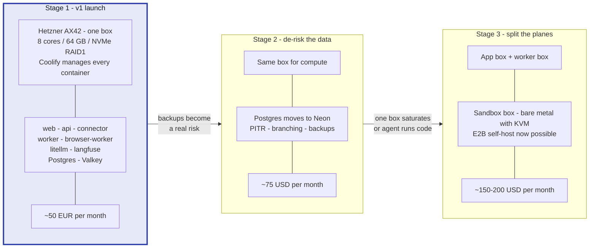
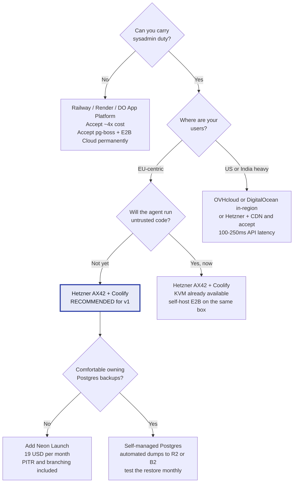

# Hosting options and cost

**SocialPi — where the stack runs, independent of any one provider**

> Companion documents: [`deployment-architecture.md`](./deployment-architecture.md) — the logical architecture and request lifecycle. [`open-source-stack-audit.md`](./open-source-stack-audit.md) — which components were cleared and why.

| | |
|---|---|
| **Researched** | 12 August 2026 |
| **Question** | What is the most cost-effective place to run this, given no provider is assumed? |
| **Recommendation** | **One Hetzner dedicated box (AX42) running Coolify** — ~€49/month, and it removes both blockers Railway imposed |

---

## The headline

The cheapest credible option is also the one with the fewest restrictions.

| Option | v1 cost / month | Docker daemon | `/dev/kvm` | Ops burden |
|---|---|---|---|---|
| Railway | ~$200–250 | ❌ | ❌ | Lowest |
| **Hetzner AX42 + Coolify** | **~€49 (~$53)** | ✅ | ✅ | High |
| Hetzner AX42 + Coolify + Neon | ~$75 | ✅ | ✅ | Medium |

**One €49 bare-metal box gives you roughly 8× the RAM of the ~$200 Railway setup, plus the two capabilities Railway could not provide at any price.** That is the whole finding.

The trade is real and it is operational, not technical: you become the sysadmin. Everything below is about whether that trade is worth taking, and how to structure it so it stays reversible.

---

## Think in capabilities, not providers

The logical architecture does not change with the provider — the services and their connections are the same everywhere. What changes is whether a provider can satisfy each requirement.

| # | Requirement | Needed by | If the provider lacks it |
|---|---|---|---|
| **R1** | Run long-lived containers | web, api, connector, worker, browser-worker, litellm, langfuse | Disqualified — this is the whole stack |
| **R2** | PostgreSQL with row-level security and backups | Everything; also the job queue | Bring managed Postgres |
| **R3** | **Access to a Docker daemon** | Trigger.dev supervisor, *if adopted* | Use `pg-boss` instead |
| **R4** | **`/dev/kvm`** — bare metal or nested virtualisation | E2B self-host, *if adopted* | Use E2B Cloud, or no sandbox |
| **R5** | Cheap or included egress | Video upload to platforms | Cost blowout — see below |
| **R6** | Private networking between services | `connector` must never be publicly routable | Firewall discipline instead |
| **R7** | Stable egress IP | Platform APIs that allowlist source addresses | May force an outbound proxy |

**R3 and R4 are the ones that eliminated Railway.** Any provider that gives you a real VM or bare metal satisfies both automatically, because you own the machine.

---

## Provider comparison

Prices are as researched on 12 Aug 2026. The European hosting market repriced heavily this year — treat all of these as needing re-verification before you commit.

| Provider | Shape | v1 cost/mo | R3 daemon | R4 KVM | Egress | Managed DB | Ops |
|---|---|---|---|---|---|---|---|
| **Hetzner AX42** | Bare metal, 8-core Ryzen, 64 GB, 2×512 GB NVMe RAID1 | **€49** + €39 setup | ✅ | ✅ | 20 TB incl. (EU) | ❌ | High |
| **Hetzner CAX31** ×2 | ARM cloud VM, 8 vCPU / 16 GB each | ~€32 | ✅ | ❌ | 20 TB incl. (EU) | ❌ | Medium |
| **OVHcloud** | VPS + cheap bare metal, EU sovereignty | ~$6.46 VPS-1 (4 vCore/8 GB) | ✅ | ✅ on metal | Generous | Partial | Medium |
| **Contabo** | RAM-per-euro leader — ~24 GB for ~€14 | ~€14 | ✅ | ⚠️ varies | Varies | ❌ | High |
| **DigitalOcean** | Droplets + managed PG + App Platform | ~$100–150 | ✅ droplets | ❌ | 4 TB | ✅ | Low–Med |
| **Fly.io** | Firecracker, many regions | ~$80–150 | ⚠️ | ❌ | Metered | ✅ | Low |
| **Railway** | Managed PaaS | ~$200–250 | ❌ | ❌ | $0.10/GB | ✅ | Lowest |

### Hetzner's 2026 price rises — read before assuming

Hetzner raised cloud prices **three times in 2026**, and the increases were not uniform:

- **April 2026** — broad rise of up to ~37–43%, applied to existing customers too.
- **15 June 2026** — CPX and CCX hit hard: **CPX22 €7.99 → €19.49 (+144%)**, **CCX13 €15.99 → €42.99 (+169%)**.
- **CAX (ARM) rose only ~30–33%** and remains the cheapest cloud line.
- Dedicated (AX) was far less affected. **AX42 is €49/month + €39 one-off setup.**

Two practical consequences:

1. **Do not build a cost model on CPX/CCX.** They are no longer the value play. CAX (ARM) or AX (bare metal) are.
2. **Existing servers keep their price, but a rescale counts as a new order** at current rates. Size with headroom rather than planning to resize.

Even after all three increases, community consensus is that Hetzner remains the cheapest — but the direction of travel matters for a multi-year plan.

---

## Recommended placement

Same logical services throughout. Only the physical placement changes.

### Why one box is defensible for v1

A single AX42 has 8 real cores and 64 GB of RAM. The entire v1 service list — nine containers — fits comfortably with room to spare. Compare against the Railway sizing, which totalled 5 vCPU and 10 GB across all services for ~$200.

You are not compromising on capacity. You are trading managed operations for roughly a quarter of the cost and the removal of two hard constraints.

---

## Choosing a provider

---

## Cost model, v1

### Recommended: Hetzner AX42 + Coolify + Neon

| Item | Cost/month | Notes |
|---|---|---|
| Hetzner AX42 | €49 (~$53) | 8-core Ryzen 7 PRO 8700GE, 64 GB, 2×512 GB NVMe RAID1. One-off €39 setup. |
| Coolify | €0 | Apache-2.0, self-hosted. Railway-like deploys on your own box. |
| Neon Launch (Postgres) | $19 | Compute $0.106/CU-hour, storage $0.35/GB-month, scale-to-zero, no monthly minimum since Dec 2025. |
| Cloudflare R2 (media) | ~$1–5 | Zero egress fee. |
| Egress | €0 | 20 TB included in EU regions. |
| **Total** | **~$75** | vs ~$200–250 on Railway, with ~8× the RAM. |

### Cheapest viable

Drop Neon, self-manage Postgres on the same box: **~$55/month**. Only do this if you will genuinely automate off-box backups *and test restores*. An untested backup is not a backup.

### Costs that scale with users — unchanged by provider

| Item | Rate | Note |
|---|---|---|
| X post | **$0.015**, **$0.20 with a link** | Price credits against the link rate. 50 link-posts/day for one user ≈ **$300/month** from that user alone. |
| LLM tokens | Per provider | Cap per tenant in LiteLLM, enforced before the call. |
| Image generation | Per provider | Meter as a discrete unit. |
| Egress | €0 on Hetzner EU (20 TB) | This is where self-hosting wins hardest. The same video traffic costs $0.10/GB on Railway. |

**Egress is the sleeper cost for this product.** A platform that uploads video is egress-heavy by nature. 1 TB/month costs $100 on Railway and €0 on Hetzner. Over a year that difference alone exceeds the entire Hetzner bill.

---

## What you take on

Be honest about this before committing — these are the real costs of the cheap option.

| Risk | Mitigation |
|---|---|
| **You are the sysadmin.** OS patching, Docker upgrades, TLS renewal, monitoring, 3am incidents. | Coolify automates deploys, TLS and rollbacks. Budget a day of setup and a few hours a month. |
| **Single point of failure.** RAID1 survives a disk; it does not survive a motherboard or a datacentre incident. | Accept for v1. Keep an infrastructure-as-code definition so a rebuild is hours, not days. Move to Stage 3 before it becomes revenue-critical. |
| **Backups are yours.** | Managed Postgres (Neon) is the clean answer. Otherwise automated dumps off-box, and a **restore test every month**. |
| **EU location, global users.** 100–250ms to US/India. | Cloudflare fronts static assets, but API calls still cross. If India is the primary market, revisit the provider choice — this is the strongest argument against Hetzner. |
| **Prices moved 3× in 2026.** | Bare metal was least affected. Do not assume today's rate holds; re-check annually. |
| **No managed anything.** No one-click read replicas, autoscaling or point-in-time recovery. | You do not need these at v1. Know the point at which you will. |

---

## The rule that keeps this reversible

**Depend on no provider-specific primitive.** Everything in this stack is OCI containers plus PostgreSQL plus Valkey — nothing else. That means:

- No Railway-specific networking, no Vercel-only rendering features, no AWS Lambda handlers, no proprietary queue service.
- The deployment is a Docker Compose file plus environment variables. Moving providers is bringing up the same compose file somewhere else and restoring the database.
- Coolify itself is Apache-2.0 and is only a control plane — if you abandon it, the containers keep running.

This is the practical meaning of *deployment-first*: the architecture must not encode where it runs. Get that right and the provider decision stops being permanent — which matters more than getting it perfect now, given how much European hosting repriced this year.

---

## Recommendation

**Start on one Hetzner AX42 with Coolify and Neon Postgres, at roughly $75/month.**

It is about a third of the Railway cost, removes both capability blockers, includes 20 TB of egress, and keeps every future option open — including self-hosting E2B on the very same machine, since bare metal already provides KVM.

Revisit if any of these become true:

- **India or US becomes the primary market** → latency argues for an in-region provider.
- **Revenue depends on uptime** → move to Stage 3, or accept managed hosting's premium as insurance.
- **You cannot staff the sysadmin duty** → go back to Railway or DigitalOcean App Platform and treat the extra ~$150/month as buying operational cover.

That last one is a legitimate choice, not a failure. The point of the audit is to know what the premium buys and what it costs — not to assume cheapest wins.

---

## Sources

- [Hetzner June 2026 price adjustment](https://docs.hetzner.com/general/infrastructure-and-availability/price-adjustment/) · [2026 increases analysed](https://northflank.com/blog/hetzner-cloud-server-price-increases) · [CPX/CCX shock](https://byteiota.com/hetzner-june-2026-price-shock/)
- [Hetzner AX42](https://www.hetzner.com/dedicated-rootserver/ax42/) · [Hetzner cloud pricing after April 2026](https://www.bitdoze.com/hetzner-cloud-cost-optimized-plans/)
- [Coolify vs Dokploy comparison](https://introserv.com/blog/dokploy-vs-coolify-complete-comparison-of-the-best-self-hosted-paas-platforms-for-vps-and-dedicated-servers-2026/)
- [Neon pricing 2026](https://vela.simplyblock.io/articles/neon-serverless-postgres-pricing-2026/) · [Neon vs Supabase](https://makerkit.dev/pricing-calculator/supabase-vs-neon)
- [Hetzner alternatives after the increases](https://noackhosting.com/blog/hetzner-alternative-2026/)
- [Railway pricing](https://docs.railway.com/pricing/plans) · [X API pricing 2026](https://postproxy.dev/blog/x-api-pricing-2026/)

---

*Costs are estimates from published rates on 12 August 2026, not vendor quotes. European hosting repriced substantially through 2026 — verify current pricing before budgeting.*
