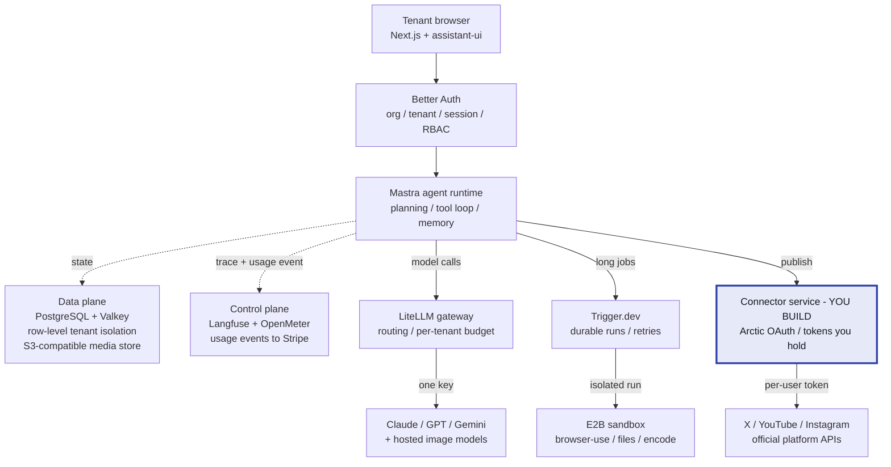
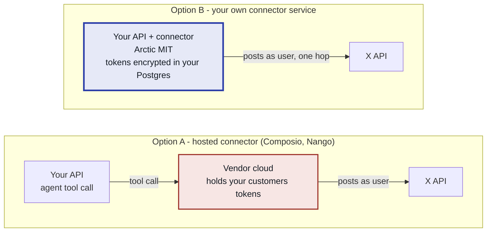

# A licence-clean stack for a multi-tenant agentic platform

**SocialPi — licence audit & reference architecture**

> Rendered version with full diagrams: [`open-source-stack-audit.html`](./open-source-stack-audit.html)

| | |
|---|---|
| **Verified** | 12 August 2026 |
| **Business model assumed** | Multi-tenant paid SaaS — anyone signs up, pays, and asks an agent to do work |
| **Projects checked** | 26 |
| **Method** | Read each project's `LICENSE` at `HEAD`; walked `git` history where relicensing was suspected |

---

## The one-line verdict

A complete stack exists under MIT / Apache-2.0 / BSD with no restrictions on reselling as a hosted multi-tenant service — **except for the third-party OAuth and social-publishing layer**, where every serious option is either licence-blocked, copyleft, or a closed-source vendor cloud.

Build that one service yourself on **Arctic** (MIT). It is roughly four OAuth integrations, and it is the part of the product a competitor cannot trivially copy.

---

## Why this audit exists

Kortix (formerly Suna) is described as Apache-2.0 across essentially the entire first page of search results. Its actual `LICENSE` file tells a different story:

- Apache-2.0 from Oct 2024 until **3 Dec 2025**
- Relicensed to the bespoke **Kortix Public Source License**, which bans SaaS, rebranding and commercialisation by name
- Replaced again on **18 Feb 2026** with **Elastic License 2.0** — commit `a79ce3f`, message: *"LICENSE: ELv2 (was already replaced, now committed)"*

Two relicensings in eleven weeks, both closing off hosted resale. Every project below was therefore checked at source, and the same check should be repeated before launch, because any of these can change under you the same way.

---

## Cleared — build on these

Verified permissive, no hosted-service restriction.

| Layer | Project | Licence | Status | What to watch |
|---|---|---|---|---|
| Web app | Next.js | `MIT` | ✅ Clear | Stable licence since inception. |
| Chat UI | assistant-ui | `MIT` | ✅ Clear | Streaming chat, tool-call rendering, generative UI. Saves weeks. |
| Agent runtime | Mastra | `Apache-2.0` | ⚠️ `ee/` carve-out | Core is clean Apache-2.0. Anything under `ee/` is proprietary — do not deploy that directory. |
| LLM abstraction | Vercel AI SDK | `Apache-2.0` | ✅ Clear | The SDK is free and open. Only the AI Gateway is a paid Vercel service — replaced here by LiteLLM. |
| Model gateway | LiteLLM | `MIT` | ⚠️ `enterprise/` carve-out | MIT core; the `enterprise/` directory is separately licensed. Per-tenant keys, budgets and spend tracking all sit in the free core. |
| Auth & tenancy | Better Auth | `MIT` | ✅ Clear | Organisations plugin gives you tenants, invites and roles out of the box. |
| OAuth clients | Arctic | `MIT` | 🔷 Key piece | Typed OAuth 2.0 clients for the major providers. This is what the connector service is built on. |
| Durable jobs | Trigger.dev | `Apache-2.0` | ✅ Clear | Non-negotiable: agent runs and video uploads exceed serverless timeouts. Temporal (`MIT`) is the heavier alternative. |
| Sandbox | E2B | `Apache-2.0` | ✅ Clear | Never run agent-generated code in your API process. |
| Browser control | browser-use | `MIT` | ✅ Clear | For sites with no usable API. Run it inside the sandbox, never on the host. |
| Observability | Langfuse | `MIT` | ⚠️ `ee/` carve-out | MIT core; `ee/`, `web/src/ee/` and `worker/src/ee/` are proprietary. Cost-per-tenant attribution is in the free core. |
| Usage metering | OpenMeter | `Apache-2.0` | ✅ Clear | Meters token spend into Stripe. Choose this over Lago, which is AGPL-3.0. |
| Database | PostgreSQL | `PostgreSQL` | ✅ Clear | BSD-style. Row-level security is your tenant isolation boundary. |
| Cache & queue | Valkey | `BSD-3-Clause` | ✅ Clear | Use instead of Redis, which moved to RSAL/SSPL. Drop-in compatible. |
| Workflow builder | Sim | `Apache-2.0` | ✅ Optional | Only if you want a visual canvas for users. Adds surface area; skip for v1. |

> **On the three carve-outs:** Mastra, LiteLLM and Langfuse are still safe to build on, but their proprietary directories must be excluded from your Docker images, and CI should assert they are never pulled in. GitHub reports all three as licence "Other", not MIT/Apache — that is the signal to read the file.

---

## Blocked — do not build on these

| Project | Licence | Blocking clause |
|---|---|---|
| **Kortix / Suna** | `Elastic v2` | *"You may not provide the software to third parties as a hosted or managed service…"* Was Apache-2.0 until Dec 2025; forking that commit strands you on an abandoned Python architecture with no upstream path. |
| **Nango** | `Elastic v2` | Identical hosted-service ban. This is the one that would have solved the OAuth layer — hence the gap below. |
| **Dify** | `Apache + conditions` | *"You may not use the Dify source code to operate a multi-tenant environment"* without written authorisation. |
| **n8n** | `Sustainable Use` | Internal business use only. Hosting it for paying users requires a negotiated commercial Embed licence. |
| **Postiz** | `AGPL-3.0` | Network copyleft: serving it over a network obliges you to release your modified source to those users. |
| **Lago · MinIO** | `AGPL-3.0` | Same trigger. Use OpenMeter, and S3/R2 or SeaweedFS instead. |
| **ComfyUI** | `GPL-3.0` | Viral if embedded. Call hosted image APIs instead; don't self-host generation for v1. |
| **Redis** | `RSALv2 / SSPL` | Managed-service restrictions since 2024. Valkey is the BSD fork. |

> **On AGPL specifically:** reasonable lawyers disagree about where the boundary falls when you merely deploy an unmodified AGPL service alongside your own. That ambiguity is itself the reason to avoid it — you do not want an unresolved licence question surfacing in an acquisition or enterprise-security review.

---

## Conditional — legal to use, but not what they appear to be

| Project | Licence | The catch |
|---|---|---|
| **Composio** | `MIT` (SDK only) | The SDK is genuinely MIT, but the backend that stores your customers' OAuth tokens and executes tool calls is closed-source and runs on Composio's cloud. Self-hosting is an enterprise sales conversation. A vendor dependency wearing an open-source badge — your customers' tokens leave your infrastructure. |
| **Mixpost** | `MIT` (Lite) + paid Pro | Lite is MIT but covers only X and Facebook and ships **no API**. The API, eleven networks and basic white-label are Pro — $299 one-time, $1,199 enterprise. A cheap, honest commercial licence; just not open source. |
| **Activepieces** | `MIT` + proprietary `ee/` | MIT core, but `packages/ee/` and `packages/server/api/src/app/ee` hold exactly the features you need — multi-tenancy and white-label. |

Stripe, Anthropic, OpenAI, Google, Replicate and your cloud provider are ordinary paid vendors. Their terms of service matter operationally, but they raise no source-licence question — you are calling an API, not redistributing software.

---

## Architecture

One request path, three branches off the agent runtime. The only box written from scratch is highlighted.

Everything except the highlighted box is an existing MIT / Apache-2.0 / BSD component deployed unmodified. The connector service is the one piece with no clean off-the-shelf option — and it is where your customers' credentials live, so owning it is a security win as well as a licence one.

---

## Why the OAuth layer has to be yours

Every candidate for "let my agent post to a user's X account" fails a different way. The difference is not a feature — it is where the refresh token physically sits.

The hop that disappears is the whole argument. Option B removes a vendor from the credential path, removes a licence question, and removes a per-call cost — at the price of running your own OAuth app registration and review with each platform, which Option A does not actually spare you either.

| | |
|---|---|
| **Scope of the build** | **4 providers** — X, YouTube, Instagram, LinkedIn. Standard OAuth 2.0 authorisation-code flow with refresh, which Arctic already implements per provider. |
| **What you own** | **Token custody** — encrypted refresh tokens per tenant per platform, plus rotation and revocation. This is the audit answer enterprise buyers will ask for. |
| **Unavoidable either way** | **App review** — Meta, TikTok and YouTube each require their own developer-app review. Weeks, not days; start before writing the agent. |

---

## How this runs in production

Every cleared component ships as a container, so the whole system is one Compose file to start and a Kubernetes namespace later.

- **Stateless tier** — Next.js app, agent runtime, connector service. Horizontally scaled behind a load balancer; no session affinity needed because Better Auth sessions live in Postgres.
- **Worker tier** — Trigger.dev workers. Scale on queue depth, not request rate. This is where the long tail of video uploads and multi-step agent runs actually executes.
- **Sandbox tier** — E2B, isolated at the network level with no route back to your database. Treat every sandbox as hostile.
- **Stateful tier** — Postgres with row-level security keyed on tenant, Valkey, and object storage. Use managed Postgres from day one; agent platforms generate far more write traffic than a normal CRUD SaaS.
- **Shared services** — LiteLLM and Langfuse as their own deployments, so a gateway restart never takes the app down.

### Sequencing

1. **Register the platform developer apps first.** Review queues are the long pole and nothing else is blocked by starting them.
2. **Auth, tenancy, billing skeleton.** Better Auth + Stripe + OpenMeter, with a hard per-tenant spend cap enforced in LiteLLM *before* any agent exists. Uncapped token spend is how these products die.
3. **Connector service for one platform.** X only, end to end, real tokens.
4. **Agent runtime on top.** Mastra with three tools: generate image, compose post, publish. Resist adding more until one works reliably.
5. **Sandbox and durable jobs** once tasks start exceeding a single request.

### The cost model to get right early

X moved to pay-per-use in Feb 2026: about **$0.015 per post, rising to $0.20 when the post contains a link**. Price your credits against the link rate, not the text rate — a single user auto-posting fifty links a day costs roughly **$300/month** in platform fees before a token of inference. Meter with OpenMeter from day one rather than retrofitting it.

Note also that since **April 2026, follow / like / quote-post writes were removed from all self-serve X tiers** — if the pitch includes engagement automation, that capability no longer exists via API.

---

## Primary sources

Licence files read directly:

- [Kortix / Suna `LICENSE`](https://github.com/kortix-ai/suna/blob/main/LICENSE) · [relicensing commit `a79ce3f`](https://github.com/kortix-ai/suna/commit/a79ce3f684aa689f59f1e24df27fe99dcfe93d25)
- [Nango `LICENSE`](https://raw.githubusercontent.com/NangoHQ/nango/master/LICENSE)
- [Mastra `LICENSE.md`](https://raw.githubusercontent.com/mastra-ai/mastra/main/LICENSE.md)
- [LiteLLM `LICENSE`](https://raw.githubusercontent.com/BerriAI/litellm/main/LICENSE)
- [Langfuse `LICENSE`](https://raw.githubusercontent.com/langfuse/langfuse/main/LICENSE)
- [Activepieces `LICENSE`](https://raw.githubusercontent.com/activepieces/activepieces/main/LICENSE)
- [Vercel AI SDK `LICENSE`](https://raw.githubusercontent.com/vercel/ai/main/LICENSE)
- [Dify `LICENSE`](https://github.com/langgenius/dify/blob/main/LICENSE) · [multi-tenant discussion #4685](https://github.com/langgenius/dify/issues/4685)
- [n8n Sustainable Use License](https://docs.n8n.io/privacy-and-security/sustainable-use-license)

Supporting research:

- [Composio self-hosting reality](https://nango.dev/blog/best-self-hosted-api-integration-platforms-for-ai-agents/)
- [Mixpost Lite vs Pro](https://docs.mixpost.app/)
- [X API pricing 2026](https://postproxy.dev/blog/x-api-pricing-2026/)

---

*Licences verified 12 August 2026 by reading each project's `LICENSE` at `HEAD`, plus `git` history where a relicensing was suspected. Licences change — Kortix changed twice in eleven weeks — so re-run this check before launch and pin the commit you build against.*

*This is an engineering read of licence text, not legal advice. Have counsel confirm the final stack before taking payment.*
