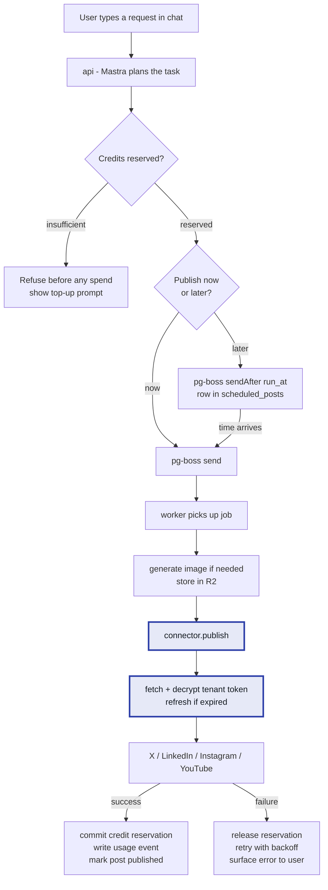
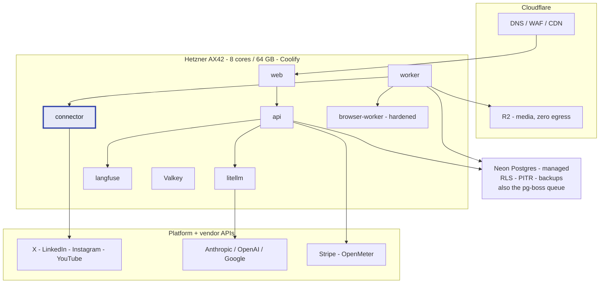

# v1 blueprint

**SocialPi — what v1 is, how it works, and how it gets built**

> Companion documents: [`hosting-options.md`](./hosting-options.md) — where it runs and what it costs. [`deployment-architecture.md`](./deployment-architecture.md) — logical architecture and request lifecycle. [`open-source-stack-audit.md`](./open-source-stack-audit.md) — licence clearance.

| Decision | Choice |
|---|---|
| **Platforms** | X, LinkedIn, Instagram, YouTube — all four at launch |
| **Market** | Global, region undecided — build region-agnostic, start in EU for cost |
| **Billing** | Prepaid credits |
| **Scheduling** | Immediate **and** scheduled posting |
| **Sandbox** | None. Fixed agent toolset, no code execution |
| **Host** | One Hetzner AX42 + Coolify + Neon Postgres (~$75/mo) |

---

## What v1 is

A tenant signs up, connects their social accounts, buys credits, and types what they want in plain English. An agent plans it, generates any media needed, and publishes — now or at a scheduled time.

### In scope

- Email signup, organisations, roles, invites
- Connect accounts on **X, LinkedIn, Instagram, YouTube** via OAuth
- Chat interface — user types a request, agent plans and executes
- Generate images from a prompt
- Compose post text, adapted per platform
- Publish immediately, or schedule for a future time in the tenant's timezone
- Calendar view of scheduled and published posts; edit and cancel before publish
- Prepaid credits with a visible balance, top-up via Stripe, hard stop at zero
- Per-tenant spend caps enforced before every model call

### Explicitly out of scope

- Analytics and engagement metrics
- Reply/inbox management, comment moderation
- Video *generation* (upload of user-supplied video is in scope)
- Team approval workflows
- The agent writing and executing its own code
- Mobile apps
- White-label / reseller

---

## The critical path is app review, not code

Four platforms means four developer-app registrations, and **Meta, Google and TikTok reviews take weeks and can reject you**. Nothing in the codebase blocks starting them.

| Platform | Review weight | Notes |
|---|---|---|
| **X** | Light | Pay-per-use API. $0.015/post, **$0.20 if the post contains a link**. Since Apr 2026, follow/like/quote writes are gone from self-serve tiers. |
| **LinkedIn** | Medium | Requires a company page and product request for posting scopes. |
| **Instagram** | **Heavy** | Meta App Review. Business/Creator accounts only, via a linked Facebook Page. Graph API accepts a **`video_url`** — publish by URL from R2 and skip egress entirely. |
| **YouTube** | **Heavy** | Google OAuth verification + security assessment for sensitive scopes. Upload quota is a hard constraint — check your daily limit before promising volume. |

**Day one action:** register all four in parallel, before writing application code. Build against X first because it unblocks fastest; the other three are the same connector pattern with different adapters.

---

## Service list

Nine containers, all on one box, managed by Coolify.

| Service | Public? | Purpose |
|---|---|---|
| `web` | ✅ | Next.js + assistant-ui. The only public route. |
| `api` | ❌ | Mastra agent runtime + Better Auth. Plans tasks, streams responses. |
| `connector` | ❌ | Arctic OAuth. **Sole holder of decryption keys for tenant tokens.** Only service allowed to call platform APIs. |
| `worker` | ❌ | pg-boss consumers. Executes queued and scheduled jobs. |
| `browser-worker` | ❌ | Playwright. Hardened. Only for targets with no usable API. |
| `litellm` | ❌ | Model gateway. Enforces per-tenant budget before every call. |
| `langfuse` | ❌ | Traces, cost attribution per tenant. |
| Postgres | ❌ | **Neon (managed).** App data, RLS, and the pg-boss queue. |
| Valkey | ❌ | Cache, rate limits, session lookups. |

---

## How a request flows

Two paths now, because v1 has scheduling.

Scheduling uses **pg-boss's own `sendAfter`** rather than a custom poller — one less moving part, and the queue already guarantees at-least-once delivery with retries. The `scheduled_posts` row exists so the calendar UI has something to read, edit and cancel against.

---

## Credits

Prepaid credits exist to solve one specific problem: **a post containing a link costs you $0.20 on X, thirteen times a plain post.** Flat subscriptions bleed money on exactly the users who post most.

### Reserve, then commit

Never charge on request and never charge on completion alone. Async jobs fail.

1. **Reserve** at request time — balance check plus a `credit_reservations` row. Fails fast and visibly if the balance is short.
2. **Commit** on success — reservation converts to a ledger debit.
3. **Release** on failure — reservation is voided, credits return.

This is what stops a failed YouTube upload from silently burning a customer's balance.

### Indicative pricing

Set retail at roughly $0.02/credit and price each action against its worst-case cost:

| Action | Credits | Why |
|---|---|---|
| Agent turn (planning) | 1–3 | Scales with tokens; cap per tenant in LiteLLM |
| Text post | 1 | ~$0.015 platform cost |
| **Post containing a link** | **15** | **$0.20 on X — the one that must not be underpriced** |
| Image generation | 5 | Provider cost plus margin |
| Video upload | 20 | Egress plus platform processing |

Calibrate against real invoices after the first month. The important property is that **every priced action maps to a metered cost**, so margin is knowable rather than hoped for.

---

## Data model

Every tenant-scoped table carries `tenant_id` and is protected by **row-level security**. RLS is the isolation boundary, not application code.

| Table | Notes |
|---|---|
| `tenants` | Includes `timezone` — required for scheduling |
| `users`, `memberships` | Better Auth organisations; role per membership |
| `social_connections` | Per tenant per platform: handle, scopes, `access_token_enc`, `refresh_token_enc`, `expires_at`, status |
| `credit_ledger` | Append-only. `delta`, `reason`, `ref_type`, `ref_id`, `balance_after` |
| `credit_reservations` | `amount`, `status` (held/committed/released), `job_id` |
| `conversations`, `messages` | Agent chat history |
| `posts` | `status`, `body`, `media_id`, `scheduled_for`, `published_at`, `platform_post_id`, `error` |
| `media_assets` | R2 key, mime, bytes, provenance |
| `usage_events` | Feeds OpenMeter; one row per metered action |
| pg-boss tables | Owned by pg-boss in its own schema |

**Store all timestamps in UTC.** Render in the tenant's timezone. Scheduling bugs are almost always a timezone stored at the wrong layer.

---

## Security posture for v1

No sandbox, because the agent has a **fixed toolset and never executes code it writes**. The controls that matter instead:

- **`connector` is the only service holding token decryption keys.** `api` and `worker` request a publish; they never see credentials. This is the boundary an enterprise buyer will ask about.
- **Tokens encrypted at rest**, key supplied by environment, rotated on a schedule. Move to a KMS when a customer requires it.
- **RLS on every tenant table**, enforced in the database.
- **`browser-worker` hardened**: non-root, read-only rootfs, dropped capabilities, seccomp profile, and **no network route back to Postgres**. It handles untrusted *data* (pages, uploaded media), so treat it as the most likely thing to be compromised.
- **Spend cap checked before the model call**, not after.
- **Only `web` is publicly routable.** Everything else is private.

If you later add code execution, the isolation step is **gVisor with the systrap platform** — strong isolation with no hardware-virtualisation requirement, so it runs on ordinary hosts. Firecracker/E2B only if you are running genuinely hostile code at volume.

---

## Deployment

**Because the market is undecided, the region rule matters more than the region.** Everything is OCI containers plus Postgres plus Valkey — no provider-specific primitives. Start in EU on cost; if India or the US becomes primary, the app tier moves with a compose file and a database restore rather than a rewrite.

Neon is managed from day one specifically because the market is undecided: it makes the eventual region move a data migration you can plan, not an outage you discover.

---

## Build order

Numbered because this genuinely is a dependency chain.

| # | Milestone | Depends on | Rough duration |
|---|---|---|---|
| 0 | **Register all four developer apps.** Submit Meta and Google review immediately. | Nothing — start today | Ongoing, weeks |
| 1 | Infrastructure: AX42, Coolify, Neon, Cloudflare, compose file, CI deploy | — | ~1 week |
| 2 | Auth + tenancy: Better Auth orgs, roles, invites, RLS policies | 1 | ~1 week |
| 3 | Credits: ledger, reservations, Stripe top-up, LiteLLM spend cap | 2 | ~1.5 weeks |
| 4 | `connector` for **X**: OAuth, encrypted token storage, refresh, publish | 2 | ~1.5 weeks |
| 5 | Agent runtime: Mastra with three tools — generate image, compose post, publish | 3, 4 | ~2 weeks |
| 6 | Scheduling: `scheduled_posts`, pg-boss `sendAfter`, calendar UI, timezone handling | 5 | ~2 weeks |
| 7 | Connectors for LinkedIn, Instagram, YouTube — as approvals land | 4, 0 | ~1 week each |
| 8 | Hardening: `browser-worker` profile, Langfuse dashboards, OpenMeter reconciliation | 5 | ~1 week |

**Realistic v1: 10–12 weeks of build, with launch gated by the slowest platform approval.** Steps 1–6 give a working single-platform product in roughly 8 weeks; step 7 is repetition of a solved pattern. If Meta or Google review runs long, ship with the platforms you have approved and add the rest without a re-architecture — the connector interface is identical across all four.

---

## Definition of done for v1

- A new tenant can sign up, connect all four platforms, buy credits, and publish to each — immediately and on a schedule.
- A failed publish releases its credit reservation, and the user sees why it failed.
- Every agent run produces a Langfuse trace and a metered usage event.
- A tenant cannot read another tenant's rows, verified by test with RLS enabled.
- The whole stack rebuilds from the compose file and a database restore on a fresh box in under two hours.

That last one is the deployment-first test. If it fails, you do not have a deployment — you have a machine you are afraid of.

---

*Assumptions recorded 13 August 2026. Costs and platform terms verified 12 August 2026 — re-verify X and Meta pricing before pricing credits, as both changed materially during 2026.*
